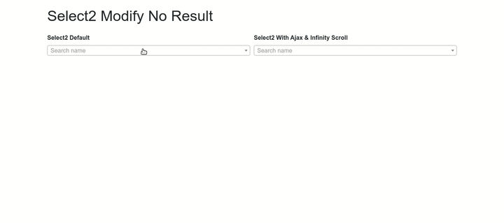

# Select2 Modify No Result

I'm just modify the [select2](http://select2.org) library, when the data what we searching for not found its not gonna show `No Results Found`, but I overide it to showing link to add that data by Pop Up Modal and when it saves its gonna added back to the select2.

## Here is the demo

I made this using [Codeigniter 4](https://codeigniter.org) Framework, and also I'm implement select2 using ajax data source and Infinity Scroll